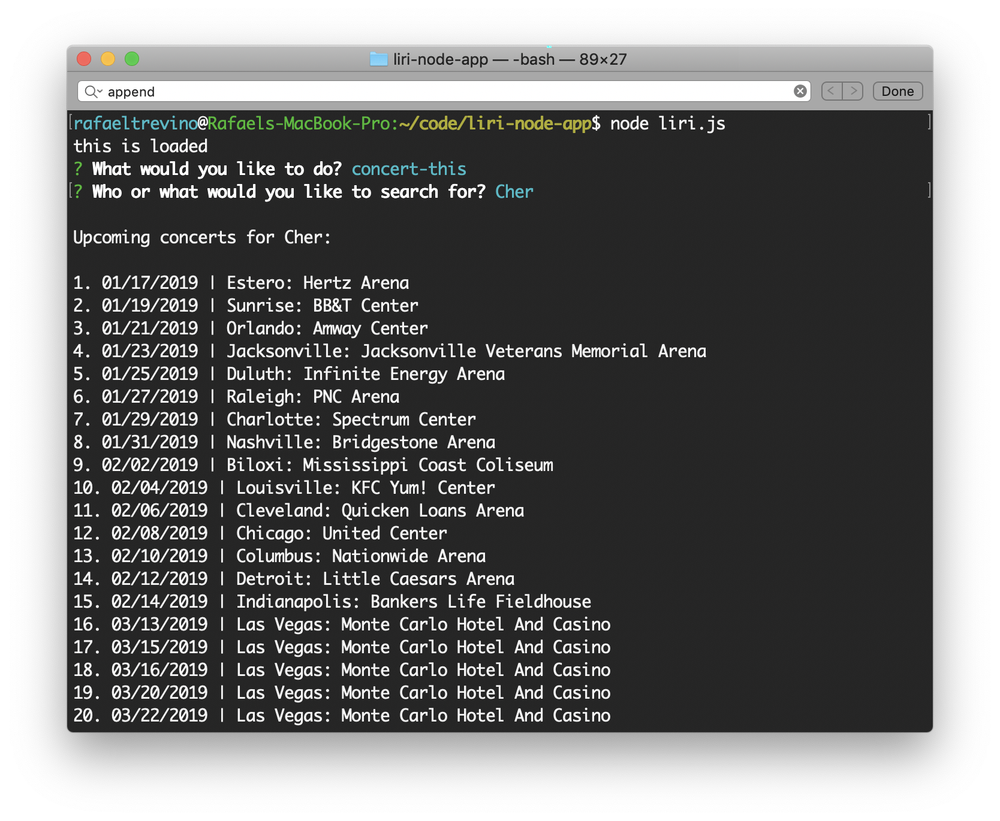
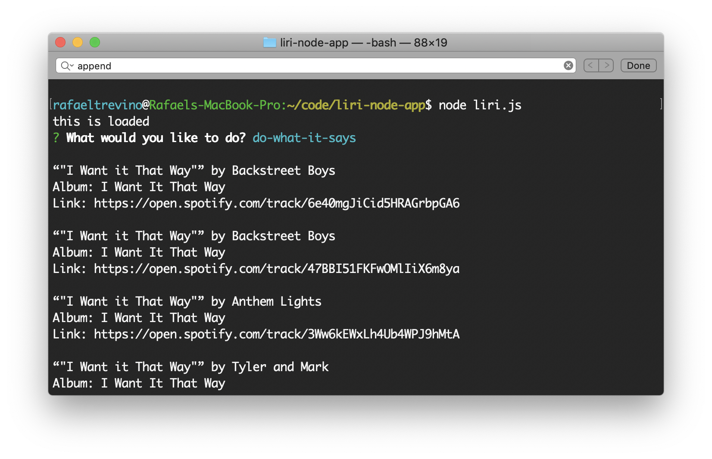
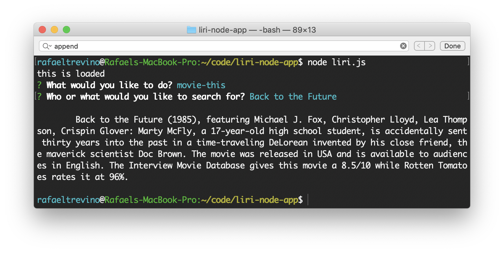

# LIRI Entertainment Search

Search for a concert through Bands in Town, a song on Spotify, or a movie on OMDB.

## Example Usage

[Video](https://drive.google.com/file/d/1x9-K7F1_M5i4Jz9665icXPGtTM8-XL4_/view)

This video shows examples of the following searches:
1. Concert based on default (no entry at prompt) of ”Enrique Iglesias”.
2. Song based on default of ”The Sign”.
3. Movie based on default of ”Mr. Nobody”.
4. ”do-what-it-says”, which draws search criteria based on a file (random.txt), a “spotify-this-song” search for “I Want it That Way” in this case.
5. A user search for concerts by Cher.
6. A user search for the song title, ”All I Want for Christmas.”
7. A user search for the movie _Bird Box_.
8. ”do-what-it-says”, with the contents of random.txt changed to a “movie-this” search for _Roma_.

## Built With

* Node.js

## APIs

* Concerts: [Bands In Town API](http://www.artists.bandsintown.com/bandsintown-api)
* Songs: [Node-Spotify-API](https://www.npmjs.com/package/node-spotify-api)
* Movies: [OMDB API](http://www.omdbapi.com)

